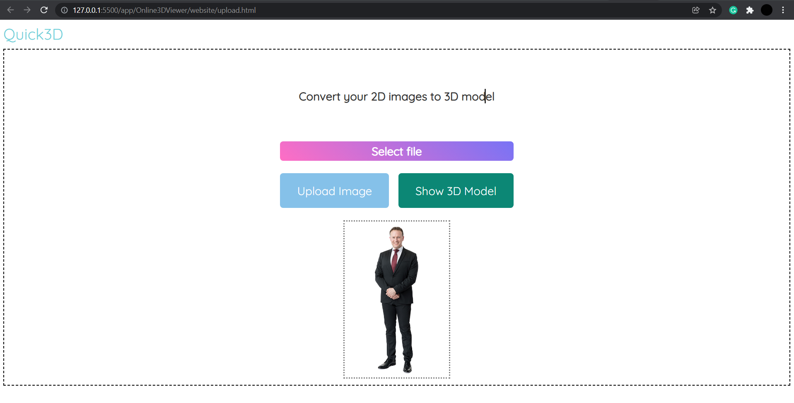
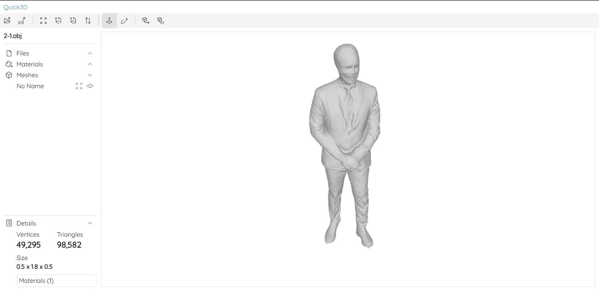
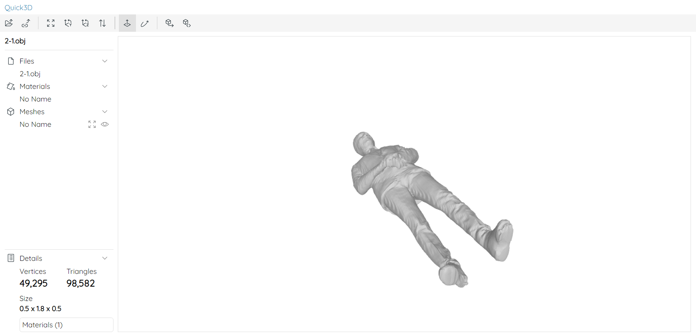
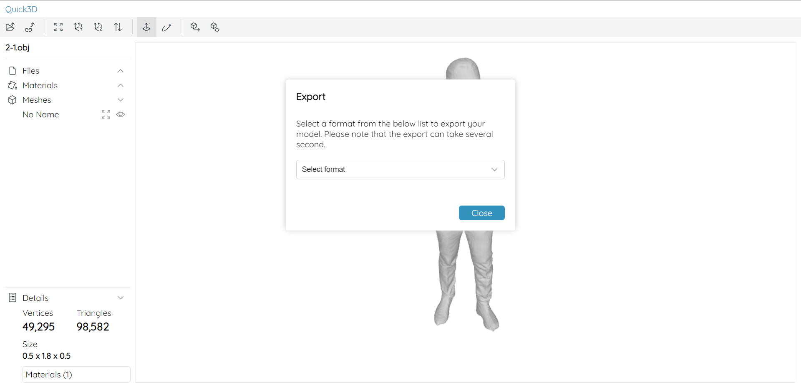

# Quick3D

## Installation

1. Downloading Pretrained Models

    ```bash
    git clone https://github.com/Daniil-Osokin/lightweight-human-pose-estimation.pytorch.git 
    cd lightweight-human-pose-estimation.pytorch 
    wget https://download.01.org/opencv/openvino_training_extensions/models/human_pose_estimation/checkpoint_iter_370000.pth
    cd ../src/scripts
    !sh download_trained_model.sh
    ```

2. Reach out to me for the configuration files of firebase project if needed! ;)

3. Setup your own paths where needed.

4. Run Server

    ```bash
    python server.py
    ```

5. Run localhost or any server you want to test.

6. open `upload.html` in your browser.

7. Click on `Upload` button and upload your image and wait for the server to show you 3D model of the corresponding image.

8. You can view/rotate/zoom/add a texture mesh on the model.

9. You can also export the 3D model to any 3D formats.


## Android App

We also have the Android app for the 3D Human Digitization.
